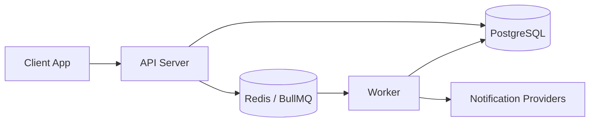
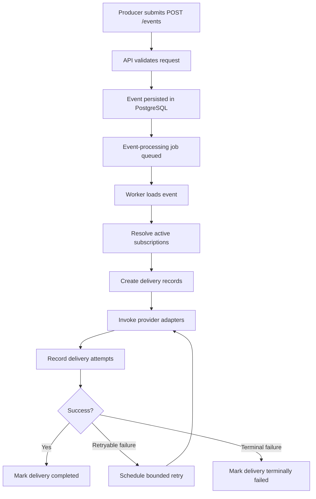

# Event-Driven Notification Platform

Event-Driven Notification Platform is a backend service that accepts application events and delivers notifications to subscribed systems through multiple channels. It is designed as a serious engineering planning project centered on asynchronous processing, durable state, delivery traceability, and clear service boundaries.

The platform models the kind of internal notification infrastructure used behind systems such as GitHub notifications, Stripe webhooks, Slack alerts, and payment status updates. Producers submit events, the platform stores them durably, resolves matching subscriptions, creates delivery records, queues background work, invokes channel providers, and preserves attempt history and final outcomes for audit and troubleshooting.

## Example Event

```json
{
  "event": "order.created",
  "userId": "123",
  "data": {
    "orderId": "ORD-555",
    "amount": 250
  }
}
```

## Tech Stack

- Node.js
- Express
- TypeScript
- PostgreSQL
- Redis
- BullMQ

Architecture style: `API + Queue + Worker`

## Core Features

- **Event ingestion**: Accepts producer-submitted events through an HTTP API and treats accepted events as durable system inputs.
- **Subscription management**: Maintains routing rules that determine which destinations should receive which event types.
- **Delivery creation**: Creates delivery records from matched subscriptions so notification work is explicit and traceable.
- **Delivery attempt history**: Preserves each send attempt as historical evidence rather than overwriting prior outcomes.
- **Retry handling**: Retries transient failures with bounded policy while allowing terminally failed outcomes to remain visible.
- **Async processing**: Separates event acceptance from notification execution through queue and worker processing.
- **Webhook signing**: Signs outbound webhook deliveries so subscriber systems can verify authenticity.
- **Monitoring APIs**: Exposes admin/internal inspection surfaces for events, subscriptions, deliveries, and attempts.
- **Auditability and traceability**: Supports investigation through durable records, status history, and correlation-friendly flows.

## System Architecture

The system uses a clean separation between ingestion, durable storage, asynchronous execution, and provider delivery.

- **API Layer**: Accepts producer and admin/internal requests, validates inputs at the boundary, and coordinates application behavior.
- **Queue Layer**: Represents asynchronous execution work and decouples request responsiveness from downstream delivery latency.
- **Worker Layer**: Loads accepted events, resolves subscriptions, creates deliveries, invokes providers, records attempts, and updates outcomes.
- **Database**: Acts as the durable source of truth for events, subscriptions, deliveries, and delivery attempts.
- **Providers**: Channel adapters for email, signed webhooks, and mocked SMS delivery behavior.



## Event Processing Flow

1. Producer sends `POST /events`.
2. API validates the request and stores the accepted event durably.
3. An event-processing job is queued.
4. A worker loads the event from durable storage.
5. The worker resolves active matching subscriptions.
6. Delivery records are created for matched subscribers.
7. Providers are invoked for each delivery channel.
8. Delivery attempts are recorded with outcome details.
9. Retries are scheduled when failures are transient and policy allows.



## Delivery Channels

- **Email**: Delivered through an email provider adapter.
- **Webhook**: Delivered as signed outbound HTTP requests to subscriber endpoints.
- **SMS**: Delivered through a mocked SMS provider for initial scope.

All channels are abstracted behind provider adapters so delivery behavior remains extensible and channel-specific logic stays outside the core workflow.

## Key Design Principles

- **Database as durable source of truth**: Accepted events and delivery state live in durable storage rather than in queue memory.
- **Queue used for execution, not business state**: Redis and BullMQ coordinate asynchronous work but do not define the canonical system record.
- **At-least-once processing tolerance**: The design accepts duplicate-execution risk in exchange for simpler and more resilient async processing.
- **Append-only delivery attempt history**: Attempt records preserve operational history for troubleshooting, audit, and retry analysis.
- **Clear trust boundaries**: Producer ingestion, admin/internal access, worker execution, and outbound webhook delivery are treated as separate trust domains.
- **Async-first architecture**: Event acceptance is kept responsive while slower notification work happens out of band.

## Documentation Map

The full planning and design set lives in [`docs/`](./docs).

- [`docs/01-project-overview.md`](./docs/01-project-overview.md): Phase 0 system overview covering vision, scope, architecture direction, core concepts, and design principles.
- [`docs/02-user-stories-and-requirements.md`](./docs/02-user-stories-and-requirements.md): Product behavior definition with actors, epics, user stories, acceptance criteria, and functional and non-functional requirements.
- [`docs/03-architecture-and-components.md`](./docs/03-architecture-and-components.md): Architectural structure of the platform, including component boundaries, layered design, interaction flow, and delivery-processing responsibilities.
- [`docs/04-database-design.md`](./docs/04-database-design.md): Conceptual and logical relational data model for events, subscriptions, deliveries, delivery attempts, and audit-oriented lifecycle concerns.
- [`docs/05-api-specification.md`](./docs/05-api-specification.md): External and admin/internal HTTP contract definition for event ingestion, subscription management, delivery inspection, and response conventions.
- [`docs/06-queue-and-worker-design.md`](./docs/06-queue-and-worker-design.md): Asynchronous execution design covering job lifecycle, worker responsibilities, retry handling, failure classification, and operational signals.
- [`docs/07-security-and-trust.md`](./docs/07-security-and-trust.md): Security model and trust-boundary planning for producer access, admin/internal access, webhook signing, validation, and safe operational visibility.
- [`docs/08-testing-strategy.md`](./docs/08-testing-strategy.md): Verification strategy spanning unit, integration, contract, async, retry, and security-oriented testing expectations.
- [`docs/09-decisions-and-tradeoffs.md`](./docs/09-decisions-and-tradeoffs.md): Consolidated record of major design choices, the alternatives not chosen, and the tradeoffs those decisions introduce.
- [`docs/10-future-improvements.md`](./docs/10-future-improvements.md): Structured view of likely future enhancements, scalability evolutions, security hardening, and operational maturity paths.

## Testing Strategy

The testing approach is intentionally layered rather than relying only on end-to-end coverage. The design emphasizes unit tests for core decision logic, integration tests for durable state and system interactions, API contract tests for request and response quality, async workflow tests for queue and worker correctness, and security-oriented tests for trust-boundary behavior.

Particular attention is given to asynchronous execution, retry behavior, duplicate-work tolerance, and delivery outcome visibility. Full details are documented in [`docs/08-testing-strategy.md`](./docs/08-testing-strategy.md).

## Security Model

The security posture assumes trusted producer ingestion, protected admin/internal access, and explicit trust handling at system boundaries. Outbound webhooks are signed, requests are validated at the boundary, administrative capabilities are separated from producer behavior, and error exposure should remain useful without leaking unnecessary detail.

The full trust and security design is documented in [`docs/07-security-and-trust.md`](./docs/07-security-and-trust.md).

## Future Evolution

The current design intentionally leaves room for future improvements without overcomplicating the initial platform. Likely evolution areas include idempotency keys for event ingestion, per-delivery jobs, dead-letter queues, multi-worker scaling, role-based access control, secret rotation, and replay or recovery operations.

See [`docs/10-future-improvements.md`](./docs/10-future-improvements.md) for the full forward-looking roadmap.

## Project Goals

This project is intended to demonstrate:

- distributed system thinking
- asynchronous processing design
- reliable delivery patterns
- backend architecture documentation
- production-style system planning

## License

License to be determined.
