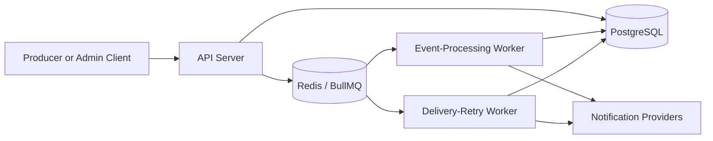
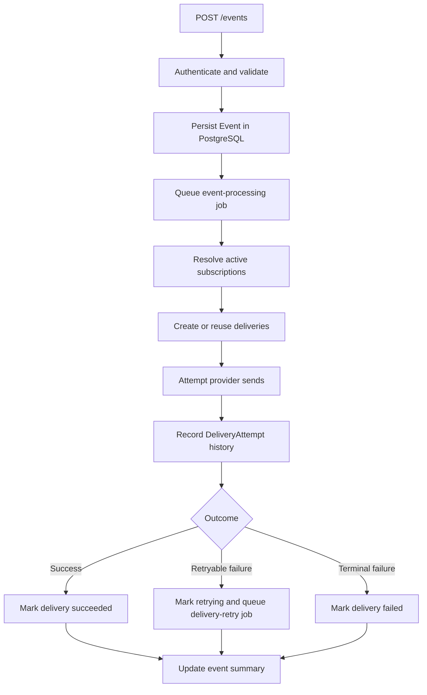

# Event-Driven Notification Platform

Event-Driven Notification Platform is a backend service that accepts application events, resolves matching subscriptions, and delivers notifications across email, webhook, and mocked SMS channels. It is built around an `API + Queue + Worker` architecture with durable PostgreSQL state, BullMQ-backed asynchronous execution, append-only delivery-attempt history, bounded retries, operational inspection APIs, and practical security hardening.

The project models the kind of internal notification infrastructure used behind systems like GitHub notifications, Stripe webhooks, Slack alerts, and payment status updates. It exists to demonstrate production-style backend planning and implementation around reliable event ingestion, delivery traceability, failure handling, and clear service boundaries.

## Why This Project Exists

Many systems need to accept business events quickly while deferring slower notification work to background processing. This platform separates event acceptance from delivery execution so producers stay responsive while the system preserves durable truth, retry state, and operational history.

## Core Features

- **Trusted event ingestion**: `POST /events` requires producer authentication and durably records accepted events before background work begins.
- **Subscription management**: Admin/internal APIs create, list, inspect, and update subscriptions that map event types to channels and destinations.
- **Delivery materialization**: Matching subscriptions become durable delivery records with channel and target snapshotted at creation time.
- **Provider execution**: Workers send notifications through provider adapters for email, webhook, and mocked SMS.
- **Delivery-attempt history**: Every real send attempt creates an append-only `DeliveryAttempt` record for audit and troubleshooting.
- **Retry handling**: Retryable failures are classified, scheduled through BullMQ, and bounded by durable retry state on each delivery.
- **Operational inspection APIs**: Events, deliveries, and attempts can be listed and inspected through admin/internal read endpoints.
- **Webhook signing**: Outbound webhook deliveries include deterministic HMAC-based signing headers plus event and correlation context.
- **Auditability and traceability**: Event, delivery, and attempt flows preserve correlation IDs, request IDs, status history, and safe operational summaries.

## Tech Stack

- Node.js
- Express
- TypeScript
- PostgreSQL
- Redis
- BullMQ
- TypeORM
- Zod
- Jest

## High-Level Architecture

- **API server** accepts producer and admin/internal HTTP requests, validates input, applies auth guards, and persists durable state.
- **PostgreSQL** is the source of truth for events, subscriptions, deliveries, and delivery attempts.
- **Redis / BullMQ** carries execution work for initial event fanout and delayed delivery retries.
- **Event-processing worker** resolves subscriptions, creates deliveries, executes first attempts, and updates event state.
- **Retry worker** reloads durable delivery state and performs scheduled retry attempts without creating new deliveries.
- **Provider adapters** isolate channel-specific behavior for email, webhook, and SMS.



## Event Processing Flow

1. A trusted producer sends `POST /events`.
2. The API authenticates the producer, validates the payload, persists the event, and queues an `event-processing` job.
3. The event-processing worker reloads the event, resolves active matching subscriptions, and materializes deliveries.
4. Each eligible delivery is attempted through the appropriate provider adapter.
5. A `DeliveryAttempt` record is created for every real send attempt.
6. Deliveries are marked `succeeded`, `retrying`, or `failed` based on provider outcome and retry policy.
7. Retryable failures schedule delayed `delivery-retry` jobs.
8. Event status is summarized from its derived delivery states.



## Documentation Index

The design set in [`docs/`](./docs) captures the planning work that guided the implementation:

- [`docs/01-project-overview.md`](./docs/01-project-overview.md): Vision, scope, success criteria, architecture direction, and core concepts.
- [`docs/02-user-stories-and-requirements.md`](./docs/02-user-stories-and-requirements.md): Actors, epics, user stories, acceptance criteria, and functional requirements.
- [`docs/03-architecture-and-components.md`](./docs/03-architecture-and-components.md): Runtime components, boundaries, layered architecture, and interaction flow.
- [`docs/04-database-design.md`](./docs/04-database-design.md): Logical data model for events, subscriptions, deliveries, and delivery attempts.
- [`docs/05-api-specification.md`](./docs/05-api-specification.md): HTTP contract for event ingestion, subscription APIs, and inspection endpoints.
- [`docs/06-queue-and-worker-design.md`](./docs/06-queue-and-worker-design.md): Async job lifecycle, worker responsibilities, failure handling, and retry execution design.
- [`docs/07-security-and-trust.md`](./docs/07-security-and-trust.md): Trust boundaries, auth expectations, webhook authenticity, and safe exposure rules.
- [`docs/08-testing-strategy.md`](./docs/08-testing-strategy.md): Test layers, async scenarios, security-oriented testing, and requirements traceability.
- [`docs/09-decisions-and-tradeoffs.md`](./docs/09-decisions-and-tradeoffs.md): Consolidated record of major architectural and product decisions.
- [`docs/10-future-improvements.md`](./docs/10-future-improvements.md): Deferred capabilities, scalability evolution, and longer-term hardening opportunities.

## Local Setup

### Prerequisites

- Node.js 18+ recommended
- PostgreSQL
- Redis

The app currently uses TypeORM `synchronize: true` for local development, so tables are created automatically on startup.

### Quick Start

1. Install dependencies:

```bash
npm install
```

2. Copy `.env.example` to `.env`.

PowerShell:

```powershell
Copy-Item .env.example .env
```

3. Start PostgreSQL and Redis.

Example Docker containers:

```bash
docker run --name enp-postgres -e POSTGRES_USER=postgres -e POSTGRES_PASSWORD=postgres -e POSTGRES_DB=event_notification_platform -p 5432:5432 -d postgres:16
```

```bash
docker run --name enp-redis -p 6379:6379 -d redis:7
```

4. Start the API server:

```bash
npm run dev
```

5. In separate terminals, start the workers:

```bash
npm run worker
```

```bash
npm run worker:retry
```

If PowerShell blocks the `npm` shim on your machine, run the same commands with `npm.cmd` instead.

### API and Worker Roles

- `npm run dev` starts the HTTP API server.
- `npm run worker` starts the event-processing worker for initial fanout and first attempts.
- `npm run worker:retry` starts the retry worker for delayed delivery retries.

## Environment Variables

| Variable | Purpose |
| --- | --- |
| `PORT` | API server port. |
| `DATABASE_URL` | PostgreSQL connection string. |
| `REDIS_HOST` | Redis host used by the API and workers. |
| `REDIS_PORT` | Redis port used by the API and workers. |
| `DEFAULT_MAX_RETRY_LIMIT` | Default retry cap applied to new deliveries. |
| `RETRY_BASE_DELAY_MS` | Base delay used when scheduling retry jobs. |
| `PRODUCER_API_KEY` | Shared secret for producer access to `POST /events`. |
| `ADMIN_API_KEY` | Shared secret for admin/internal subscription and inspection APIs. |
| `WEBHOOK_SIGNING_SECRET_DEFAULT` | Platform-level secret used for outbound webhook signing. |

Relevant request headers:

- `x-producer-api-key` for producer event ingestion
- `x-admin-api-key` for admin/internal subscription and inspection APIs
- `x-correlation-id` to supply or propagate a correlation reference
- `x-producer-reference` to identify the authenticated producer context

## Available Scripts

| Script | Purpose |
| --- | --- |
| `npm run dev` | Start the API server in development mode. |
| `npm run build` | Compile the TypeScript project to `dist/`. |
| `npm test` | Run the automated test suite. |
| `npm run worker` | Start the event-processing worker. |
| `npm run worker:retry` | Start the delivery-retry worker. |
| `npm start` | Run the compiled API server from `dist/`. |

## Smoke Test Flow

1. Check health:

```bash
curl http://localhost:3000/health
```

2. Create a subscription with admin access:

```bash
curl -X POST http://localhost:3000/subscriptions \
  -H "Content-Type: application/json" \
  -H "x-admin-api-key: local-admin-key" \
  -d "{\"eventType\":\"order.created\",\"channel\":\"webhook\",\"target\":\"https://example.com/webhook\"}"
```

3. Submit an event with producer access:

```bash
curl -X POST http://localhost:3000/events \
  -H "Content-Type: application/json" \
  -H "x-producer-api-key: local-producer-key" \
  -H "x-correlation-id: corr-demo-1" \
  -d "{\"event\":\"order.created\",\"data\":{\"orderId\":\"ORD-555\",\"amount\":250}}"
```

4. Inspect stored resources with admin access:

```bash
curl -H "x-admin-api-key: local-admin-key" http://localhost:3000/events
```

```bash
curl -H "x-admin-api-key: local-admin-key" http://localhost:3000/deliveries
```

## Current Implementation Status

The repository is functionally complete for the documented scope through Sprint 6, with this Sprint 7 pass focused on stabilization and polish. The current backend includes:

- authenticated producer ingestion
- authenticated admin/internal subscription and inspection APIs
- durable event, delivery, and delivery-attempt storage
- duplicate-safe event processing
- provider execution for email, webhook, and mocked SMS
- bounded retries with delayed BullMQ scheduling
- outbound webhook signing
- request and correlation propagation across API and worker paths

## Known Limitations

The current implementation is intentionally scoped and does not yet include:

- dead-letter queues
- replay tooling or manual retry endpoints
- dashboards or UI
- advanced RBAC or OAuth/JWT infrastructure
- per-subscription webhook secret lifecycle management
- formal database migrations; local development currently relies on TypeORM schema synchronization
- production deployment automation
- advanced analytics or reporting pipelines
- real external email or SMS provider integrations

## Testing Summary

The test suite covers API behavior, worker execution, retry handling, webhook signing, auth guards, duplicate-safe processing, and inspection endpoints. Tests run with deterministic doubles and `pg-mem`, so they do not require external worker processes or third-party providers.

```bash
npm test
```

```bash
npm run build
```

## Future Evolution

The architecture is intentionally prepared for future improvements without baking them into the initial implementation. Natural next steps include idempotency keys for event ingestion, stronger secret management, dead-letter handling, replay and recovery tooling, multi-worker scaling, richer admin queries, and production deployment hardening.

See [`docs/10-future-improvements.md`](./docs/10-future-improvements.md) for the structured roadmap.

## License

This project is licensed under the [MIT License](./LICENSE).
