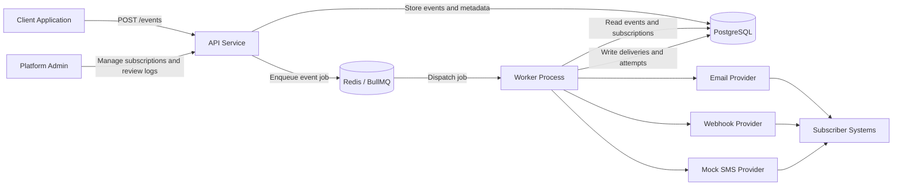
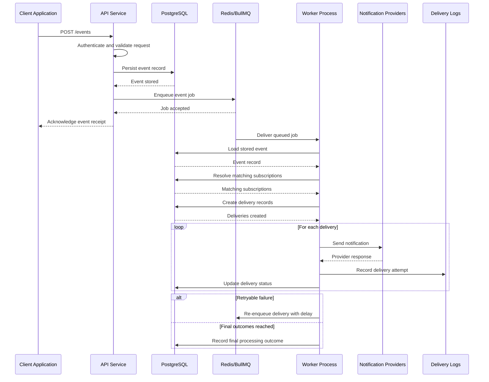

# Event-Driven Notification Platform

## Phase 0 Project Overview

**Document status:** Draft  
**Phase:** Phase 0 - Planning and Architecture  
**Primary audience:** Backend engineers, architects, and technical reviewers  
**Purpose:** Define the system vision, scope, actors, capabilities, and high-level architecture before implementation begins.

**Planned implementation stack for later phases:** Node.js, Express, TypeScript, PostgreSQL, Redis, BullMQ  
**Important note:** This document is intentionally limited to architecture, planning, and system design. It does not include implementation code.

## 1. Project Vision and Problem Statement

Modern applications generate domain events such as `order.created`, `invoice.failed`, `user.registered`, or `deployment.completed`. Those events often need to trigger notifications for people, services, or downstream systems. When each application implements its own notification logic, the result is usually duplicated effort, inconsistent retry behavior, weak observability, and tightly coupled integrations.

An event-driven notification platform solves this by centralizing notification responsibilities behind a dedicated service. Producer applications submit events once, and the platform determines who should be notified, through which channel, and with what delivery guarantees and logging.

This type of platform exists because notification delivery is operationally complex. Even a small system must address:

- asynchronous processing so request latency is not tied to provider latency
- subscription routing so the right recipients receive the right events
- retries and failure handling for unstable downstream providers
- auditability so teams can understand what was sent and why
- security controls such as request authentication and webhook signing

Real-world examples include:

- GitHub-style repository and workflow notifications
- Stripe-style webhook alerts for billing and payment events
- internal platform alerts for deployments, incidents, and infrastructure changes
- e-commerce updates such as order creation, shipment, and refund notifications

The motivation for building this system is to create a realistic internal backend service that demonstrates how event ingestion, asynchronous job processing, subscription management, multi-channel delivery, and delivery logging work together in a cohesive architecture.

**System description:** The Event-Driven Notification Platform is a backend service that accepts event payloads from client applications, stores them as durable event records, queues them for asynchronous processing, resolves subscriptions, and delivers notifications through email, webhooks, and mocked SMS while recording delivery outcomes for operations and troubleshooting.

## Success Criteria

The platform will be considered successful at this phase when the intended architecture clearly supports the following outcomes:

- valid events are accepted through a stable ingestion boundary and persisted durably before downstream work begins
- event processing is asynchronous so producer-facing request handling is not coupled to provider latency
- matching subscriptions are resolved consistently for supported event types and channels
- delivery records and delivery attempts are created and logged as first-class operational artifacts
- transient provider or network failures can be retried using bounded retry behavior
- final outcomes are auditable end-to-end from submitted event to delivery completion or terminal failure

## Design Principles

The platform is guided by a small set of architectural principles intended to keep the design reliable, understandable, and extensible:

- **Durability before delivery:** An event should be stored as a durable system record before any notification work is attempted.
- **Asynchronous processing by default:** Delivery execution should occur outside the client request path so ingestion remains responsive and resilient.
- **Separation of ingestion and delivery concerns:** Event acceptance, subscription resolution, and provider communication should be treated as distinct responsibilities.
- **Extensibility through provider abstraction:** Channel-specific behavior should sit behind provider boundaries so new delivery integrations can be introduced without changing the producer contract.
- **Observability through logs and delivery history:** The platform should preserve enough history to explain what happened to each event and each delivery.
- **Failure-aware processing:** Transient failures should be retried intentionally, while terminal failures should remain visible for investigation and audit.

## Core Domain Concepts

The platform revolves around a small set of domain concepts that shape its behavior without prescribing a low-level schema:

| Concept | Description |
| --- | --- |
| Event | An immutable business occurrence submitted by a client application and accepted as the platform's unit of intake. |
| Subscription | A routing rule that determines which recipient should receive which event type through which channel. |
| Delivery | A notification instance generated when an event matches a subscription and is scheduled for a specific channel destination. |
| Delivery Attempt | A single attempt to execute a delivery through a provider, including its outcome and any retry implications. |

## 2. Scope Definition

### In Scope

The following capabilities are included in Phase 0 system planning and intended for later implementation:

- event ingestion through an API endpoint such as `POST /events`
- validation of incoming event payload structure and required metadata
- persistent storage of events for audit and processing
- subscription management for mapping event types to recipients and channels
- support for multiple notification channels: email, webhook, and mocked SMS
- asynchronous processing using a queue-backed worker model
- delivery record creation and status tracking
- retry handling for transient delivery failures
- capped retry attempts with terminal failure states
- webhook request signing for authenticity verification
- delivery attempt logging for operational visibility
- provider abstraction so channels can be implemented behind a common platform interface
- basic administrative control over subscriptions and operational review through APIs or internal tooling assumptions

### Out of Scope

The following items are explicitly excluded from this phase and from the initial platform target:

- a full web-based dashboard or end-user UI
- multi-tenant billing, pricing, or customer account management
- production-grade SMS provider integration
- advanced user preference centers or notification personalization
- large-scale distributed deployment across regions or clusters
- exactly-once delivery guarantees
- advanced analytics dashboards and reporting pipelines
- production infrastructure automation, secrets rotation, and full DevOps workflows
- complex template authoring systems for rich message composition
- enterprise compliance programs, legal retention rules, or full governance workflows

## 3. System Actors

| Actor | Description | Primary Responsibilities |
| --- | --- | --- |
| Client Application | A producer system that emits business events. | Submits events to the platform, includes required payload data, and treats the platform as the notification entry point. |
| Platform Admin | An internal operator or engineering owner of the platform. | Configures subscriptions, reviews delivery outcomes, investigates failures, and manages operational settings. |
| Subscriber System | A downstream recipient of notifications. This may be a webhook endpoint, email destination, or SMS target. | Receives notifications and may act on them or store them for further processing. |
| Worker Process | The asynchronous execution component that consumes queued jobs. | Pulls event jobs from the queue, resolves subscriptions, creates deliveries, invokes providers, and records outcomes. |
| Notification Provider | A delivery adapter or external service responsible for a specific channel. | Sends email, executes webhook calls, or simulates SMS delivery and returns delivery status to the platform. |

## 4. System Capabilities

At a high level, the platform must be able to:

- accept events from external client applications through a stable API
- validate and persist incoming events before attempting delivery
- allow event subscriptions to be registered per event type and channel
- process notifications asynchronously so event ingestion remains fast and reliable
- determine which subscribers should receive a given event
- deliver notifications through multiple channels using provider-specific adapters
- retry transient failures according to a defined retry policy
- record delivery logs and attempt history for audit and troubleshooting
- verify webhook authenticity using signed requests
- separate producer concerns from delivery concerns so client applications remain simple

## 5. High-Level Feature List

### Event Management

- **Event ingestion:** Receive event submissions from client applications through a consistent API contract.
- **Payload validation:** Check required fields, structural correctness, and supported event naming conventions.
- **Event persistence:** Store each event as a durable record before downstream processing begins.
- **Event status tracking:** Maintain high-level lifecycle states such as accepted, queued, processing, completed, and failed as appropriate.

### Subscription Management

- **Subscription registration:** Define which recipients or systems should receive specific event types.
- **Channel binding:** Associate subscriptions with email, webhook, or SMS delivery channels.
- **Destination configuration:** Store recipient metadata such as email addresses, webhook URLs, or mock SMS targets.
- **Subscription lifecycle control:** Enable subscriptions to be created, updated, activated, deactivated, or removed.

### Notification Delivery

- **Multi-channel routing:** Deliver the same event to one or more channels depending on matching subscriptions.
- **Provider abstraction:** Isolate delivery logic behind provider interfaces so channel implementations remain replaceable.
- **Webhook signing:** Attach signatures to webhook requests so subscribers can verify authenticity.
- **Mock SMS support:** Provide a placeholder SMS path suitable for development and architectural completeness.

### Queue Processing

- **Asynchronous job dispatch:** Decouple ingestion from delivery using Redis-backed job processing.
- **Worker execution:** Process queued events outside the client request lifecycle.
- **Retry policy:** Re-attempt transient failures with capped retries and controlled delay or backoff.
- **Terminal failure handling:** Mark exhausted deliveries clearly for operator review.

### Delivery Monitoring

- **Delivery records:** Track every intended notification generated from an event.
- **Attempt logs:** Record each send attempt, response outcome, and timing information.
- **Operational traceability:** Preserve enough context to understand which event triggered which delivery and through which provider.
- **Failure investigation support:** Enable future tooling or APIs to inspect failed deliveries and retry history.

### Security

- **Trusted producer authentication:** Restrict event ingestion to known client applications using managed trust boundaries.
- **Webhook HMAC signing:** Sign outbound webhook requests with a shared secret so receiving systems can verify authenticity and payload integrity.
- **Input validation at API boundaries:** Validate event structure, supported fields, and required metadata before persistence or queueing occurs.
- **Request tracing and correlation:** Preserve correlation identifiers across ingestion, queue processing, and delivery history to support investigation and audit.
- **Auditability:** Keep durable records of submitted events and delivery outcomes.
- **Boundary isolation:** Ensure provider-specific logic does not leak into event-producing systems.

## 6. High-Level Architecture Description

The platform follows a simple asynchronous service architecture. Client applications submit events to an API service. The API validates and persists the event in PostgreSQL, then enqueues a processing job in Redis using BullMQ. A worker process consumes queued jobs, loads the event and matching subscriptions, creates delivery records, and invokes the appropriate notification providers. Provider results are written back as delivery logs and status updates.

This architecture separates the ingestion path from the delivery path. The producer receives a fast acknowledgement after the event is accepted and queued, while potentially slower or failure-prone provider operations are handled asynchronously. PostgreSQL acts as the system of record, while Redis serves as the transient execution and retry mechanism.

### Component Responsibilities

- **API Service**
  - Accepts event submissions from client applications.
  - Validates payload structure and required metadata.
  - Persists event records and administrative entities such as subscriptions.
  - Enqueues jobs for asynchronous processing.
  - Exposes administrative surfaces for managing subscriptions and reviewing operational data in future phases.

- **PostgreSQL**
  - Stores durable system records such as events, subscriptions, deliveries, and delivery attempts.
  - Serves as the audit source for what entered the platform and what delivery actions occurred.
  - Provides queryable state for operations, reporting, and troubleshooting.

- **Redis / BullMQ**
  - Holds queued jobs awaiting asynchronous processing.
  - Supports retry scheduling and decouples API responsiveness from provider execution time.
  - Acts as the job transport layer rather than the source of truth.

- **Worker Service**
  - Consumes queued event jobs.
  - Resolves matching subscriptions for an event.
  - Creates and updates delivery records.
  - Invokes channel-specific providers and applies retry behavior when needed.

- **Notification Providers**
  - Translate platform delivery requests into channel-specific actions.
  - Handle email sending, outbound webhook delivery, or mocked SMS behavior.
  - Return structured success or failure information to the worker.

### Architectural Notes

- The design assumes at-least-once processing semantics rather than exactly-once delivery.
- The database is the authoritative record of platform state; the queue is an execution mechanism.
- The initial design favors clarity and realism over extreme scale optimization.
- The worker may fan out multiple channel deliveries from a single event job. If future scale requires it, the architecture can evolve into per-delivery jobs without changing the external event ingestion contract.

## 7. Architecture Diagram

## 8. Event Flow Description

When an event is received, the platform processes it in the following high-level sequence:

1. A client application submits an event to the platform through `POST /events`.
2. The API service authenticates the caller and validates the request payload.
3. The API stores the event as a durable record in PostgreSQL.
4. The API creates a queue job in Redis/BullMQ that references the stored event.
5. The API returns an acknowledgement to the client without waiting for notification delivery to complete.
6. A worker process consumes the queued job asynchronously.
7. The worker loads the stored event record and resolves matching subscriptions for the event type.
8. The worker creates one or more delivery records, one for each subscriber-channel combination that should receive the event.
9. The worker invokes the appropriate notification providers for email, webhook, or mocked SMS delivery.
10. Each provider returns a success or failure result to the worker for the specific delivery being attempted.
11. The worker records the delivery attempt in persistent history and updates delivery status accordingly.
12. If a failure is temporary and retry attempts remain, the worker reschedules the work according to the retry policy.
13. If the delivery succeeds or retries are exhausted, the final outcome remains queryable for operations, tracing, and audit.

## 9. Event Processing Sequence Diagram

## 10. System Assumptions

The design is based on the following assumptions:

- events are submitted by trusted client applications rather than anonymous public users
- event payloads are JSON documents with a stable event name and supporting data
- incoming events contain enough context for notification delivery without requiring synchronous calls back to the producer
- the platform uses asynchronous, at-least-once processing semantics
- some downstream providers will occasionally fail due to network or service instability
- retry attempts are limited and not infinite
- webhook consumers are expected to verify request signatures
- the initial SMS channel is mocked and used for system completeness rather than real telecom delivery
- subscriptions are defined ahead of time by administrators or system owners
- local development and controlled test environments are the primary operating context for early phases

## 11. Constraints

The initial system is intentionally constrained in the following ways:

- it is designed primarily as a realistic learning and architecture project
- it is not optimized for extreme scale, very high throughput, or multi-region resilience
- it targets a local or small-team development environment first
- provider integrations are intentionally limited to email, webhooks, and mocked SMS
- production infrastructure, deployment automation, and operational hardening are outside this phase
- full end-user dashboards and analytics surfaces are not part of the initial target
- advanced compliance, billing, and enterprise management concerns are deferred
- the design should remain understandable and implementable by a small engineering team

## 12. Glossary

| Term | Definition |
| --- | --- |
| Event | A business occurrence submitted to the platform, such as `order.created` or `invoice.failed`. |
| Event Type | The named classification of an event used for routing and subscription matching. |
| Subscription | A rule that says a recipient should receive notifications for a given event type through a particular channel. |
| Channel | The delivery medium used to send a notification, such as email, webhook, or SMS. |
| Delivery | A single notification instance generated for a specific event, recipient, and channel combination. |
| Delivery Attempt | One execution attempt to send a delivery through a provider, including success or failure details. |
| Provider | A channel-specific adapter or external service that performs the actual send operation. |
| Queue | The asynchronous job transport used to process events outside the API request lifecycle. |
| Worker | The background process that consumes queued jobs and executes delivery logic. |
| Delivery Log | The stored operational record of notification attempts, outcomes, timestamps, and failure details. |
| Webhook Signing | A mechanism for attaching a cryptographic signature to webhook requests so receivers can verify authenticity. |

## Planned Documentation Roadmap

This document is intended to serve as the entry point for the broader Phase 0 documentation set. The next planned documents are:

- **User stories and requirements:** Functional goals, actor needs, and acceptance-oriented requirements.
- **Architecture and components:** Deeper component responsibilities, boundaries, and runtime interactions.
- **Database design:** Conceptual and logical data modeling for events, subscriptions, deliveries, and attempts.
- **API specification:** External and administrative API contracts, request shapes, and response expectations.
- **Queue and worker design:** Processing model, job lifecycle, retry behavior, and failure handling strategy.
- **Security:** Trust boundaries, authentication assumptions, webhook verification model, and audit considerations.
- **Testing:** Validation strategy covering unit, integration, contract, and failure-path testing.
- **Future improvements:** Deferred enhancements such as analytics, additional channels, dashboard tooling, and scale-oriented evolution.
