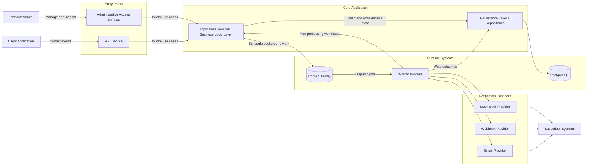

# Event-Driven Notification Platform

## Phase 2 Architecture and Components

**Document status:** Draft  
**Phase:** Phase 2 - Architecture and Components  
**Primary audience:** Backend engineers, architects, technical reviewers, and implementation planners  
**Purpose:** Translate approved requirements into an architectural structure that defines the system's components, boundaries, interactions, and design rationale before implementation begins.

**Relationship to prior documents:** This document builds on `docs/01-project-overview.md` and `docs/02-user-stories-and-requirements.md`. It describes how the platform should be structured to satisfy the defined product behavior without yet committing to database schema, migrations, or code-level implementation details.  
**Important note:** This document is intentionally implementation-free. It does not define ORM entities, SQL schema, framework wiring, or application code.

## 1. Document Purpose

This document translates the platform requirements into an architectural structure suitable for implementation planning. Its role is to define the major runtime components, the layers that organize the codebase, the responsibilities that belong in each part of the system, and the flow of control across synchronous and asynchronous paths.

The goal is to establish clear system boundaries before development begins. By documenting the architecture at this level, the project can align on where logic belongs, which components own which responsibilities, and how operational behavior such as retries, logging, and provider interaction should be structured. This document is intended to reduce architectural ambiguity while remaining above schema-level and code-level detail.

## 2. Architectural Style

The Event-Driven Notification Platform should be structured as an asynchronous, event-driven backend service with clear separation between request handling, durable state management, queued work execution, and external notification delivery.

At a high level, the architecture consists of:

- an API-facing ingestion path for accepting events and administrative operations
- a durable system of record for events, subscriptions, deliveries, and delivery attempts
- a queue-backed asynchronous execution path for delivery processing
- background workers that resolve subscriptions, perform fanout, and drive retries
- channel-specific provider adapters for email, webhook, and mocked SMS delivery

This style fits the project for several reasons:

- notification delivery is slower and less reliable than event acceptance, so it should not block the client request path
- provider communication is failure-prone and benefits from retry-oriented background execution
- delivery history and auditability require durable records independent of transient queue state
- multiple notification channels are easier to support when delivery concerns are isolated from ingestion concerns
- the architecture mirrors real internal notification systems that separate API responsiveness from operational delivery behavior

The resulting model is intentionally simple but realistic: accept and persist work synchronously, process and deliver work asynchronously, and preserve operational truth in the database rather than in the queue.

## 3. High-Level Component Model

| Component | Role | Architectural Responsibility |
| --- | --- | --- |
| API Service | External and internal request boundary | Accepts event submissions and administrative requests, performs boundary-level validation and trust checks, invokes application services, and returns request outcomes. |
| Application Services / Business Logic Layer | Use-case orchestration | Coordinates business workflows such as event acceptance, subscription management, and delivery processing by applying platform rules across repositories, queues, and providers. |
| Persistence Layer / Repositories | Durable state access boundary | Provides structured access to stored platform state such as events, subscriptions, deliveries, and attempts while keeping storage concerns out of higher-level workflows. |
| PostgreSQL | Durable system of record | Stores accepted events, subscriptions, delivery records, and processing outcomes as the authoritative platform history. |
| Redis / BullMQ | Asynchronous execution mechanism | Holds queued jobs, schedules retries, and decouples request handling from background processing. |
| Worker Process | Background execution runtime | Consumes queued work, runs delivery processing workflows, invokes providers, and progresses deliveries toward final states. |
| Notification Providers | Channel-specific delivery adapters | Translate platform delivery intent into email, webhook, or mocked SMS behavior and return normalized outcomes. |
| Administrative Access Surfaces | Internal operational access | Provide controlled ways for platform administrators to manage subscriptions and inspect platform outcomes without bypassing application rules. |

### Component Notes

- The API Service and Worker Process are separate execution contexts with different responsibilities, even when they share the same application and domain logic.
- Application Services are the coordination layer for use cases; they are not raw transport handlers and not storage engines.
- PostgreSQL is the durable source of truth.
- Redis / BullMQ is the execution and scheduling mechanism, not the long-term record of platform state.
- Administrative Access Surfaces may begin as internal APIs or operational tooling and can later evolve into a richer administrative experience.

## 4. Responsibility Boundaries

| Component | Responsible For | Explicitly Not Responsible For |
| --- | --- | --- |
| API Service | Request parsing, producer authentication, boundary validation, correlation initiation, request-to-use-case mapping, response shaping | Provider invocation, retry policy execution, durable business history modeling, queue state as authoritative truth |
| Application Services / Business Logic Layer | Use-case orchestration, business rule enforcement, coordinating persistence and queue interactions, deciding when to create deliveries and retries | Owning HTTP transport details, raw SQL concerns, provider-specific protocol details, acting as the persistent store itself |
| Persistence Layer / Repositories | Reading and writing durable platform state, exposing storage operations in application-friendly terms | Making routing decisions, classifying retryability, performing external I/O, embedding channel-specific behavior |
| PostgreSQL | Durable storage of accepted platform records and outcomes | Acting as a job queue, executing provider calls, defining runtime retry timing |
| Redis / BullMQ | Job delivery, delayed scheduling, background work dispatch, retry scheduling mechanics | Serving as the durable audit trail, resolving subscriptions, owning business truth |
| Worker Process | Executing asynchronous workflows, loading events, resolving subscriptions, creating deliveries, invoking providers, recording attempts, scheduling retries | Acting as the API boundary, owning client request validation semantics, accepting public requests directly |
| Notification Providers | Channel-specific send behavior and normalized success/failure signaling | Resolving subscriptions, storing platform truth, deciding administrative policy, owning retry history |
| Administrative Access Surfaces | Managing subscriptions, reviewing outcomes, exposing operational inspection workflows | Bypassing application services, mutating durable state without business rules, executing provider calls directly |

### Boundary Expectations

- Controllers and transport handlers should not contain provider delivery logic.
- Workers should not be responsible for first-line API boundary validation that belongs to request acceptance.
- Redis should never be treated as the authoritative record of event acceptance or final delivery outcome.
- PostgreSQL should remain the durable system of record even when jobs are in-flight or retries are pending.
- Provider adapters should not know how subscriptions are selected; they should only execute a requested delivery for their channel.

## 5. Layered Architecture

The codebase should follow a layered architecture that separates transport concerns, business workflows, domain rules, infrastructure details, and background execution responsibilities.

### API Layer

This layer contains the request-facing entry points of the system.

It should include:

- HTTP controllers or route handlers
- request authentication and authorization checks
- boundary-level input validation and request normalization
- response formatting
- correlation and request context initialization

It should not include:

- subscription resolution rules
- provider-specific delivery behavior
- direct orchestration of retry policy
- persistence details beyond invoking application-level operations

### Application Layer

This layer coordinates use cases and system workflows.

It should include:

- event ingestion workflows
- subscription management workflows
- delivery processing orchestration
- retry decision coordination
- state transition orchestration for deliveries and attempts

It should not include:

- HTTP-specific behavior
- raw infrastructure configuration
- direct knowledge of storage engine internals

### Domain Layer

This layer holds the platform's core concepts and business rules in a transport- and infrastructure-independent form.

It should include:

- concepts such as event, subscription, delivery, and delivery attempt
- business rules for active subscription matching
- delivery state semantics
- retry eligibility concepts
- normalized provider outcome concepts

It should not include:

- framework-specific request handling
- database driver behavior
- external provider protocol implementation

### Infrastructure Layer

This layer contains integrations with external systems and technical mechanisms.

It should include:

- repository implementations
- queue adapters
- provider adapters
- logging and tracing sinks
- persistence integration and external service connectivity

It should not include:

- product-level business decisions
- actor-facing request semantics
- core domain rules that should remain portable

### Background Processing Layer

This layer represents the worker runtime and job-handling entry points that execute asynchronous platform workflows.

It should include:

- job consumers and worker entry points
- mapping queued work into application-level processing use cases
- delayed retry rescheduling triggers
- runtime coordination for background execution

It should not include:

- public API routing
- direct administrative request handling
- durable business truth that belongs in the database

## 6. Component Interaction Flow

### Event Ingestion Flow

1. A client application submits an event through the API boundary.
2. The API Service authenticates the producer and validates the request shape.
3. The API Service delegates to the appropriate application service.
4. The application service records the accepted event through the persistence boundary.
5. After durable acceptance is established, the application service schedules asynchronous processing work.
6. The API Service returns an acknowledgement without waiting for notification delivery to complete.

### Asynchronous Processing Flow

1. Redis / BullMQ makes queued work available to the Worker Process.
2. The Worker Process invokes the appropriate delivery-processing application workflow.
3. The workflow loads the accepted event from durable storage.
4. The workflow resolves the active subscriptions that match the event.
5. The workflow creates delivery records representing all notification intents that should be attempted.

### Delivery Flow

1. For each delivery, the Worker Process determines the required notification provider.
2. The provider adapter executes channel-specific delivery behavior.
3. The provider returns a normalized success or failure outcome.
4. The Worker Process records the attempt outcome and updates the delivery state.
5. Successful deliveries move toward final completion; failed deliveries are evaluated for retryability.

### Retry Flow

1. When a delivery fails, the Worker Process classifies the failure outcome according to retry policy rules.
2. If the failure is retryable and retry allowance remains, the system schedules a later attempt through the queue mechanism.
3. If the failure is non-retryable or retry allowance is exhausted, the delivery is marked as terminally failed.
4. Every retry decision is reflected in durable delivery history rather than only in transient queue state.

### Monitoring and Logging Flow

1. Request handling establishes traceable context for accepted events.
2. Background processing continues that context across queued work and provider execution.
3. Delivery attempts, status transitions, and final outcomes are recorded as persistent operational history.
4. Administrative Access Surfaces use durable records, not transient worker memory, to support review and troubleshooting.

## 7. Component Diagram

## 8. Delivery Processing Design

The delivery-processing design centers on the Worker Process as the execution runtime and on application services as the owner of workflow coordination. The worker should not be a place where ad hoc delivery logic accumulates; instead, it should trigger a structured background use case that progresses accepted events into durable delivery outcomes.

### Delivery Processing Stages

1. **Load the event**
   - The worker receives queued work that references previously accepted platform state.
   - The worker loads the relevant event from the durable store rather than relying on queue payloads as authoritative truth.

2. **Resolve subscriptions**
   - The worker obtains the active subscriptions that match the event type and delivery conditions.
   - Subscription resolution should be deterministic for a given event and active subscription state.

3. **Create delivery records**
   - For each matched subscription, the system creates a delivery record representing an intended notification.
   - Delivery creation happens before provider execution so intent is visible even if provider calls fail later.

4. **Invoke providers**
   - Each delivery is mapped to the appropriate provider adapter for its channel.
   - Provider invocation returns normalized outcomes that the worker can interpret consistently across channels.

5. **Record attempts**
   - Every provider call results in a delivery attempt record.
   - Attempt history should preserve chronological visibility into what was tried and what happened.

6. **Update delivery status**
   - The worker updates the delivery state based on the provider outcome and retry policy.
   - Delivery state should reflect whether the notification is pending, retrying, succeeded, or terminally failed.

7. **Schedule retries**
   - If the failure is retryable and retry capacity remains, the worker schedules additional processing through the queue.
   - Retry scheduling should be explicit, bounded, and reflected in durable state.

### Delivery Design Considerations

- The worker should treat the queue as a trigger to process work, not as the source of business truth.
- Delivery records should be independently trackable even when multiple deliveries originate from a single event.
- Final outcomes should remain queryable after worker execution completes.
- The processing model should preserve room for later evolution from event-level fanout to per-delivery job execution if operational complexity increases.

## 9. Provider Abstraction Model

Notification delivery should be isolated behind provider abstractions that present a consistent contract to the rest of the platform while hiding channel-specific behavior.

### Provider Roles

- **Email provider adapter:** Handles email-oriented delivery behavior and returns normalized outcome information to the worker.
- **Webhook provider adapter:** Handles outbound webhook delivery behavior, including signed request requirements and response classification.
- **Mocked SMS provider adapter:** Simulates SMS delivery behavior for development and scope-appropriate completeness without introducing real telecom integration complexity.

### Why Provider Abstraction Matters

- It prevents the application and worker layers from becoming tightly coupled to channel-specific delivery behavior.
- It allows different channels to participate in the same delivery workflow with consistent outcome handling.
- It improves maintainability by confining protocol and provider concerns to replaceable adapters.
- It supports future extensibility when new channels or alternate providers are introduced.
- It improves testability by allowing delivery behavior to be reasoned about in terms of normalized outcomes rather than vendor-specific responses.

### Architectural Expectations for Providers

- Providers receive a delivery intent and return a normalized result.
- Providers should not resolve subscriptions or mutate durable platform truth directly.
- Providers should not own retry policy; they should surface outcomes that the platform can evaluate.
- Provider abstractions should preserve a stable internal contract even if the underlying delivery mechanisms evolve.

## 10. Cross-Cutting Concerns

### Validation

- Validation occurs at multiple levels, but with different purposes.
- The API boundary validates request legitimacy and required input structure.
- Application and domain workflows validate business conditions such as subscription eligibility and delivery state progression.

### Error Handling

- The architecture should distinguish between request-time rejection, recoverable processing failures, and terminal delivery failures.
- Errors should be surfaced in a way that preserves system stability and operational visibility.
- Failure classification is especially important in the worker path because it determines retry behavior.

### Logging

- The platform should emit structured operational logs at key boundaries such as event acceptance, job dispatch, delivery attempt execution, retry scheduling, and final outcome recording.
- Logs should support debugging and operational review without becoming the sole source of truth.

### Tracing and Correlation

- A traceable context should connect event submission, queued processing, delivery creation, and delivery attempts.
- Correlation data should survive transitions between API handling and background execution.
- Administrative review should be able to follow a single event across its processing lifecycle.

### Security Boundaries

- Producer trust checks belong at the API boundary.
- Webhook authenticity belongs at the outbound provider boundary.
- Administrative access should remain controlled and should not bypass business rules enforced by application services.

### Retry Awareness

- Retry behavior should be treated as a first-class architectural concern rather than an incidental transport detail.
- The architecture must preserve a clear difference between transient failure, retrying state, and a terminally failed state.
- Retry scheduling must remain bounded and visible in durable system history.

### Auditability

- Accepted events, delivery records, attempt history, and final outcomes should all be preserved in a queryable form.
- Auditability depends on keeping business truth in persistent storage rather than in queue state or transient logs.

## 11. Design Decisions and Tradeoffs

| Decision | Rationale | Tradeoff |
| --- | --- | --- |
| Use an asynchronous worker model instead of synchronous delivery | Keeps event acceptance responsive and isolates provider latency and instability from clients | Adds queue coordination and eventual-consistency considerations |
| Prefer at-least-once processing semantics over exactly-once guarantees | Simpler and more realistic for the project scope while still supporting robust delivery workflows | Requires the architecture to tolerate duplicate processing scenarios |
| Treat PostgreSQL as the system of record and Redis / BullMQ as the execution mechanism | Preserves durable auditability and reliable state outside transient job infrastructure | Requires careful coordination between stored state and queued work |
| Use provider abstraction rather than channel-specific logic embedded in workflows | Improves maintainability, clarity, and future extensibility | Introduces an extra architectural boundary that must be kept clean |
| Support mocked SMS instead of real SMS integration in the initial scope | Keeps the architecture complete without adding external integration complexity too early | Does not validate all real-world telecom constraints in the first implementation |
| Begin with event-level queued processing and worker fanout | Keeps the first architecture understandable and aligned to the current scope | May need later evolution if delivery volume or retry complexity grows significantly |
| Provide administrative access surfaces without requiring a full UI | Supports operational control and review while preserving current scope boundaries | Initial administration may be less user-friendly than a dedicated dashboard |

## 12. Risks and Architectural Considerations

| Risk / Issue | Why It Matters | Architectural Consideration |
| --- | --- | --- |
| Duplicate submissions | Clients may resend events when they are unsure whether submission succeeded | The architecture should preserve room for future duplicate-detection or idempotency-oriented safeguards |
| Duplicate deliveries from retries or repeated processing | At-least-once semantics can cause the same work to be attempted more than once | Delivery workflows should be designed with duplicate-tolerant operational behavior in mind |
| Provider instability | Email and webhook delivery paths may fail intermittently or return inconsistent results | Provider outcomes must be normalized and retry-aware, with durable attempt history |
| Invalid subscriber destinations | A subscription may reference an unreachable webhook or unusable channel destination | Delivery failure classification should support terminal failure when configuration is invalid |
| Queue backlog | A build-up of queued work can delay notification processing and obscure system health | The architecture should keep queue state observable and separate from durable business truth |
| Partial failure conditions | Some deliveries for an event may succeed while others fail or retry | Delivery state should be tracked independently per notification intent rather than only per event |
| Drift between queue state and stored state | Jobs may exist for work whose authoritative state has changed | Workers should load durable truth before acting and should not trust queue payloads alone |
| Operational blind spots | Without consistent correlation and history, failures become hard to investigate | Cross-lifecycle tracing and durable attempt logging should be built into the architecture from the start |

## 13. Future Architectural Evolution

The current architecture is intentionally scoped for clarity and a strong first implementation, but it should be able to evolve in the following directions:

- **Per-delivery jobs instead of per-event fanout:** Split large event fanout into smaller independently retryable delivery jobs.
- **Dead-letter queues:** Move exhausted or malformed background work into explicit dead-letter handling for review and recovery.
- **Rate limiting and throttling:** Protect providers and subscriber endpoints from excessive delivery volume.
- **Provider failover:** Support alternate providers for a channel when a primary provider is unavailable.
- **Richer delivery policies:** Add channel preferences, scheduling windows, or subscription-level controls in later phases.
- **Multi-tenant support:** Introduce tenant isolation, scoped administration, and tenant-aware routing if the platform expands beyond a single internal context.
- **Administrative dashboard or UI:** Layer a dedicated interface on top of the existing administrative access model for easier operations.
- **Advanced observability:** Add richer operational metrics, alerting, and backlog monitoring once runtime needs become clearer.
- **Template and content systems:** Introduce more sophisticated notification formatting and message composition after the delivery backbone is stable.
