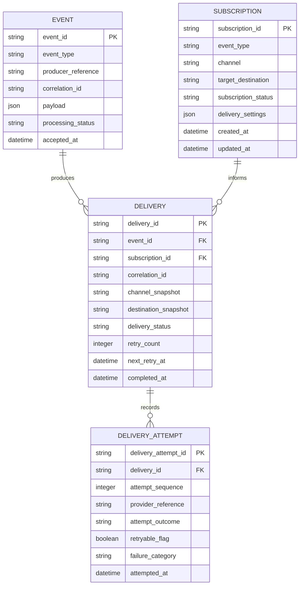

# Event-Driven Notification Platform

## Phase 3 Database Design

**Document status:** Draft  
**Phase:** Phase 3 - Database Design  
**Primary audience:** Backend engineers, architects, database designers, and technical reviewers  
**Purpose:** Define the logical database model required to support the platform's requirements, architecture, and operational behavior before implementation begins.

**Relationship to prior documents:** This document builds on `docs/01-project-overview.md`, `docs/02-user-stories-and-requirements.md`, and `docs/03-architecture-and-components.md`. It translates the approved system behavior and component model into a clear conceptual and logical relational design.  
**Important note:** This document is intentionally implementation-free. It does not include SQL migrations, ORM entities, repository code, or engine-specific tuning details.

## 1. Document Purpose

This document defines the logical database model needed to support the Event-Driven Notification Platform. Its purpose is to describe the core entities, their relationships, their logical attributes, and the integrity rules that allow the platform to accept events, resolve subscriptions, create deliveries, record attempts, and preserve final outcomes for audit and troubleshooting.

The database design is a planning artifact, not a code artifact. It exists to clarify how durable system truth should be represented before implementation begins. By agreeing on the logical data model early, the project can keep the application architecture, worker behavior, and administrative workflows aligned around a consistent source of truth.

## 2. Database Design Goals

The database design should satisfy the following goals:

- **Durability:** Accepted events and delivery outcomes must survive beyond request and worker execution lifecycles.
- **Traceability:** The model must support tracing from an accepted event to the deliveries and attempts produced from it.
- **Auditability:** Historical delivery behavior must remain reviewable after processing completes.
- **Support for asynchronous workflows:** The model must work cleanly with an API-plus-queue-plus-worker architecture in which queue state is not the authoritative business record.
- **Support for retries:** The model must represent both the current retry posture of a delivery and the historical sequence of attempts that led to the current state.
- **Maintainability:** The data model should be understandable, stable in meaning, and aligned to the platform's domain concepts rather than to framework details.
- **Separation of current state from history:** The model should distinguish between the latest delivery state and the append-only history of attempts that produced that state.
- **Operational clarity:** Administrators should be able to inspect failures, retry behavior, and final outcomes without reconstructing state from logs alone.

## 3. Core Entities

The logical model is intentionally centered on four core entities:

| Entity | Purpose |
| --- | --- |
| Event | The durable record of an accepted business event submitted by a client application. |
| Subscription | The administrative routing rule that determines which channel and destination should receive a given event type. |
| Delivery | The materialized notification intent created when an accepted event matches an active subscription. |
| Delivery Attempt | The append-only historical record of each individual attempt to execute a delivery. |

This initial model avoids introducing unnecessary supporting entities. In particular, queue jobs are not modeled as a primary relational entity because Redis / BullMQ is the execution mechanism, not the durable system of record. Additional supporting entities may be introduced later if operational needs justify them.

## 4. Entity Descriptions

### Event

The `Event` entity represents a business event that has been accepted by the platform. It is the root durable record for the notification lifecycle.

It exists because the platform must preserve accepted events independently of queue state and independently of whether downstream delivery succeeds. The event record provides the canonical business context that workers and administrators can reference later.

Its responsibility in the data model is to serve as the authoritative source for:

- what event was accepted
- which producer submitted it
- what payload context was accepted
- how the event is progressing at a high level through asynchronous processing

### Subscription

The `Subscription` entity represents an administrator-managed routing rule that links an event type to a notification channel and destination.

It exists because notification routing must be configurable independently of event ingestion. The platform needs a durable way to determine which future events should produce deliveries and which destinations should receive them.

Its responsibility in the data model is to serve as the authoritative source for:

- which event types should be matched
- which channel should be used
- which target or destination should receive the notification
- whether the subscription is currently active for new matching

### Delivery

The `Delivery` entity represents a single notification intent created from the combination of an accepted event and a matched subscription.

It exists because the platform needs a durable unit of current delivery state that is separate from both the original event and the detailed attempt history. This enables the system to track whether a notification is pending, retrying, succeeded, or terminally failed without losing the fine-grained history of how it reached that state.

Its responsibility in the data model is to serve as the authoritative source for:

- which event triggered the delivery
- which subscription caused the delivery to be created
- which channel and destination were targeted at delivery time
- what the current delivery state is
- what the current retry posture and final outcome are

### Delivery Attempt

The `Delivery Attempt` entity represents one execution attempt to send a delivery through a provider.

It exists because the platform must preserve historical visibility into retries, failures, provider behavior, and delivery progression over time. A single current-status field on `Delivery` would not be enough to explain how a final outcome was reached.

Its responsibility in the data model is to serve as the authoritative source for:

- when a send attempt occurred
- which provider was used
- whether the attempt succeeded or failed
- what failure or response information was observed
- whether the attempt was considered retryable

## 5. Key Attributes by Entity

The following attributes are logical fields, not implementation-specific column definitions.

### Event

| Logical Attribute | Purpose |
| --- | --- |
| `event_id` | Stable identifier for the accepted event record. |
| `event_type` | Named event classification, such as `order.created`. |
| `producer_reference` | Identifies the client application or producer context that submitted the event. |
| `correlation_id` | Shared tracing reference used across event, delivery, and attempt records. |
| `payload` | Canonical accepted event data and business context. |
| `processing_status` | High-level event state, such as accepted, queued, processing, processed, or completed with failures. |
| `accepted_at` | Timestamp representing durable event acceptance. |
| `queued_at` | Timestamp indicating asynchronous processing was scheduled. |
| `last_processed_at` | Timestamp of the most recent processing progression for the event. |
| `finalized_at` | Timestamp indicating the event reached a stable terminal processing summary, if applicable. |

### Subscription

| Logical Attribute | Purpose |
| --- | --- |
| `subscription_id` | Stable identifier for the subscription. |
| `event_type` | Event classification this subscription is interested in. |
| `channel` | Notification channel, such as email, webhook, or mocked SMS. |
| `target_destination` | Destination information appropriate for the channel, such as email address or webhook URL. |
| `subscription_status` | Indicates whether the subscription is active or inactive for future matching. |
| `delivery_settings` | Channel-specific or routing-specific settings that influence future delivery behavior. |
| `created_at` | Timestamp indicating when the subscription was created. |
| `updated_at` | Timestamp indicating the most recent configuration change. |
| `deactivated_at` | Timestamp indicating when the subscription became inactive, if applicable. |
| `managed_reference` | Optional administrative or ownership reference for operational use. |

### Delivery

| Logical Attribute | Purpose |
| --- | --- |
| `delivery_id` | Stable identifier for the delivery. |
| `event_id` | Reference to the accepted event that triggered the delivery. |
| `subscription_id` | Reference to the subscription that matched the event. |
| `correlation_id` | Tracing reference carried across event and attempt history. |
| `channel_snapshot` | Delivery-time copy of the channel used for this notification. |
| `destination_snapshot` | Delivery-time copy of the target destination used for this notification. |
| `provider_reference` | Identifies the provider or adapter selected for the delivery path. |
| `delivery_status` | Current delivery state, such as pending, retrying, succeeded, or terminally failed. |
| `retry_count` | Current number of attempts already consumed for this delivery. |
| `max_retry_limit` | Logical retry cap applied to the delivery. |
| `next_retry_at` | Scheduled future retry time if the delivery is retrying. |
| `last_attempt_at` | Timestamp of the most recent attempt. |
| `final_outcome_code` | High-level summary of how the delivery ended or currently stands. |
| `last_error_summary` | Latest relevant failure summary for operational visibility. |
| `created_at` | Timestamp indicating when the delivery record was created. |
| `updated_at` | Timestamp indicating the most recent status change. |
| `completed_at` | Timestamp indicating final success or terminal failure, if reached. |

### Delivery Attempt

| Logical Attribute | Purpose |
| --- | --- |
| `delivery_attempt_id` | Stable identifier for the delivery attempt. |
| `delivery_id` | Reference to the delivery being attempted. |
| `attempt_sequence` | Ordered sequence number of the attempt within the delivery lifecycle. |
| `correlation_id` | Tracing reference linking the attempt back to the broader lifecycle. |
| `provider_reference` | Identifies which provider or adapter handled the attempt. |
| `attempt_outcome` | Result of the specific attempt, such as success, transient failure, or terminal failure. |
| `retryable_flag` | Indicates whether the attempt outcome was considered retryable. |
| `failure_category` | Broad classification of failure, such as network, provider rejection, or invalid destination. |
| `error_detail` | Human-readable or normalized error context for troubleshooting. |
| `provider_response_summary` | Non-sensitive summary of provider or subscriber response context. |
| `attempted_at` | Timestamp indicating when the attempt was executed. |
| `completed_at` | Timestamp indicating when the attempt outcome was determined. |

## 6. Entity Relationships

The logical relationships between the core entities are straightforward but important:

- **One `Event` can produce zero or many `Delivery` records.**
  - Zero deliveries are possible when no active subscriptions match the accepted event.
  - Multiple deliveries are possible when the event matches multiple subscriptions.

- **One `Subscription` can produce zero or many `Delivery` records over time.**
  - A subscription may never match any event.
  - A long-lived subscription may participate in many deliveries across many events.

- **Each `Delivery` belongs to exactly one `Event` and exactly one `Subscription`.**
  - `Delivery` is the materialized relationship between an accepted event and a matched subscription.
  - This allows the platform to preserve exactly which subscription caused a delivery, even if the subscription is later changed or deactivated.

- **One `Delivery` can have zero or many `Delivery Attempt` records.**
  - Zero attempts are possible immediately after delivery creation and before the first provider call is made.
  - Multiple attempts are expected when retries occur.

- **Each `Delivery Attempt` belongs to exactly one `Delivery`.**
  - Attempts do not exist independently.
  - Attempt history is always interpreted in the context of its parent delivery.

An important modeling choice is that `Event` and `Subscription` are not directly linked to each other as a permanent pairing. Their relationship is materialized through `Delivery` at processing time, which preserves historical truth even if subscriptions change later.

## 7. Mermaid ER Diagram

## 8. State and Lifecycle Considerations

### Event Lifecycle

The `Event` entity represents accepted platform work, not every inbound request. Invalid or unauthorized submissions are rejected at the API boundary and do not become canonical event records in this core model.

Once accepted, an event may move through a lifecycle such as:

- accepted
- queued
- processing
- processed
- completed with all deliveries resolved
- completed with partial or terminal delivery failures

The event lifecycle is intentionally high-level. It provides operational summary state, while detailed delivery results live below the event level.

### Delivery Lifecycle

The `Delivery` entity should represent the current state of a single notification intent. A typical lifecycle may include:

- pending
- in progress
- retrying
- succeeded
- terminally failed

This lifecycle must be able to distinguish between work that has never been attempted, work that is still eligible for retry, and work that has reached a final outcome.

### Delivery Attempt History

`Delivery Attempt` records provide chronological history beneath the current `Delivery` state. Each attempt should remain historically visible and should not be overwritten by later attempts.

This history is important because:

- a successful delivery may only succeed after one or more prior failures
- a terminally failed delivery must show how many attempts occurred and what went wrong
- administrators need to understand not only the current state but the path taken to reach it

### Active vs Inactive Subscriptions

Subscriptions affect future matching, not historical truth. An inactive subscription should not be used when processing newly accepted events, but deliveries already created from that subscription remain historically valid.

This means the model must allow:

- subscription status changes over time
- preservation of past deliveries tied to subscriptions that are now inactive
- delivery-time snapshots so history is not reinterpreted through later subscription edits

### Retry-Related State

Retry behavior affects both `Delivery` and `Delivery Attempt`:

- `Delivery` stores the current retry posture, including how many attempts have been consumed and whether another retry is scheduled
- `Delivery Attempt` stores the historical outcome of each attempt and whether that specific attempt was classified as retryable

This separation allows the platform to answer both:

- "What is the current state of this delivery?"
- "What happened on each attempt?"

## 9. Constraints and Data Integrity Rules

The logical model should enforce the following rules:

1. An accepted `Event` must exist before any related `Delivery` can exist.
2. Every `Delivery` must reference an originating `Event`.
3. Every `Delivery` must reference the `Subscription` context that caused it to be created.
4. Every `Delivery Attempt` must belong to exactly one `Delivery`.
5. Inactive subscriptions must not be used for new event-to-subscription matching.
6. Final delivery outcomes must remain queryable even after background processing has completed.
7. `Delivery` records should preserve delivery-time channel and destination context so later subscription edits do not distort history.
8. Attempt history should be append-oriented; later attempts should not overwrite earlier attempt records.
9. State transitions should remain logically valid. For example, a terminally failed delivery should not silently return to a pending state without an explicit recovery action.
10. Correlation or tracing references should remain consistent across related event, delivery, and attempt records where such references are present.

### Possible Uniqueness Rules

The exact uniqueness strategy can be finalized later, but the logical design should preserve room for the following rules:

- each core entity should have a unique stable identifier
- `attempt_sequence` should be unique within a given `Delivery`
- the model may enforce one `Delivery` per event-to-subscription match for a given processing cycle
- the model may enforce uniqueness for exact duplicate active subscriptions if the product decides duplicate notifications from identical configuration should be prevented

These last two items are business-policy-sensitive and should be finalized together with API and operational design decisions.

## 10. Indexing and Query Considerations

The schema should support the following query patterns efficiently at a conceptual level:

| Query Need | Why It Matters |
| --- | --- |
| Retrieve an `Event` by identifier | Supports direct event inspection and linkage from external workflows. |
| Retrieve events by `correlation_id` or producer reference | Supports tracing and operational investigation across related records. |
| Retrieve active `Subscription` records by `event_type` | Supports efficient subscription matching during asynchronous processing. |
| Retrieve `Delivery` records for a given `Event` | Supports fanout inspection and event-to-delivery traceability. |
| Retrieve `Delivery` records for a given `Subscription` | Supports subscription impact review and operational troubleshooting. |
| Retrieve `Delivery Attempt` history for a given `Delivery` in chronological order | Supports retry analysis and provider troubleshooting. |
| Retrieve deliveries by current status, especially retrying or terminally failed | Supports operational review and future recovery tooling. |
| Retrieve deliveries eligible for future retry based on retry state and scheduling information | Supports worker and queue coordination without treating the queue as the system of record. |
| Retrieve records by time range | Supports audit, monitoring, and operational review. |
| Trace a correlation reference across `Event`, `Delivery`, and `Delivery Attempt` | Supports end-to-end debugging and auditability. |

The goal is not to prescribe specific indexes at this stage, but to ensure the logical model is shaped around the platform's real read and write patterns rather than around storage convenience alone.

## 11. Audit and History Model

The platform requires both current-state data and historical data because those two needs answer different operational questions.

The `Delivery` entity answers questions such as:

- What is the current state of this notification?
- Is it pending, retrying, succeeded, or terminally failed?
- What is the latest known failure context?

The `Delivery Attempt` entity answers questions such as:

- How many times was the delivery attempted?
- Which attempt failed or succeeded?
- What provider outcomes or errors were observed over time?

If the platform stored only the latest delivery state and overwrote attempt details, it would lose the ability to explain retry behavior, diagnose provider instability, and perform reliable audit or post-incident review. For that reason, the model should preserve attempt history as a durable append-oriented record while also maintaining a current summary on the parent delivery.

The same history principle applies to routing context. Because subscriptions can be edited or deactivated later, the delivery model should preserve enough snapshot information to reflect what was actually attempted at the time, rather than forcing historical interpretation through a later version of subscription configuration.

## 12. Design Decisions and Tradeoffs

| Decision | Why It Was Chosen | Tradeoff |
| --- | --- | --- |
| Keep `Event` as a durable canonical record before asynchronous work begins | Supports durability, traceability, and a clean separation between request handling and background execution | Adds coordination between durable state and queued work |
| Separate `Delivery` from `Delivery Attempt` | Preserves both current state and detailed history without forcing one record to serve conflicting purposes | Introduces another entity and lifecycle to manage |
| Keep `Subscription` state independent from delivery history | Allows subscriptions to evolve over time without rewriting historical truth | Requires snapshotting some delivery-time routing context on `Delivery` |
| Store canonical payload context on `Event` rather than duplicating full payload everywhere | Keeps the accepted event as the primary source of business context and reduces unnecessary duplication | Some historical delivery use cases may later justify additional delivery-level content snapshots |
| Use `Delivery` as the bridge between `Event` and `Subscription` | Materializes the actual matched relationship at processing time and preserves history even if subscriptions change later | Requires worker logic to create durable delivery records before provider execution |
| Do not model the queue as the source of durable truth | Aligns with the architecture in which Redis / BullMQ is an execution mechanism, not a long-term record | Requires retry and lifecycle state to be represented in the relational model as well |

## 13. Open Questions / Future Evolution

The current logical model is intentionally focused on the platform's first durable workflow. The following areas may evolve later:

- **Idempotency keys and duplicate-submission controls:** The model may later add producer-supplied uniqueness references to reduce accidental duplicate event acceptance.
- **Tenant support:** Multi-tenant growth may require tenant-scoped ownership and isolation across events, subscriptions, and deliveries.
- **Richer notification templates or content snapshots:** Later phases may require storing template references, rendered content, or more explicit delivery-time payload snapshots.
- **Dead-letter or recovery records:** Operational maturity may justify explicit durable records for exhausted or malformed background work beyond current delivery state.
- **Retention and archival strategy:** Historical attempt and delivery records may eventually need formal retention, archival, or summarization policies.
- **Provider-level metadata expansion:** Additional provider identifiers, response classifications, or reconciliation references may become useful as real integrations deepen.
- **Administrative ownership modeling:** Later phases may introduce clearer representations of who created, approved, or manages subscriptions.

