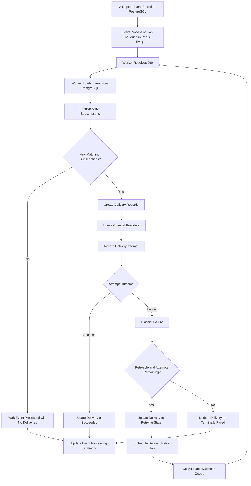

# Event-Driven Notification Platform

## Phase 5 Queue and Worker Design

**Document status:** Draft  
**Phase:** Phase 5 - Queue and Worker Design  
**Primary audience:** Backend engineers, architects, distributed systems designers, and technical reviewers  
**Purpose:** Define how asynchronous work is represented, scheduled, executed, retried, and observed after event acceptance.

**Relationship to prior documents:** This document builds on `docs/01-project-overview.md`, `docs/02-user-stories-and-requirements.md`, `docs/03-architecture-and-components.md`, `docs/04-database-design.md`, and `docs/05-api-specification.md`. It translates the platform's durability, delivery, and monitoring requirements into a concrete asynchronous execution model.  
**Important note:** This document is intentionally implementation-free. It does not include BullMQ code, Redis configuration, worker source files, or runtime tuning settings.

## 1. Document Purpose

This document defines how async work should be represented and executed after an event has been accepted by the platform. Its purpose is to clarify the responsibilities of the queue layer, the worker runtime, the job lifecycle, retry behavior, and operational failure handling before implementation begins.

The platform's request path ends once an event has been durably accepted and asynchronous work has been scheduled. From that point onward, worker-driven processing is responsible for turning accepted events into deliveries, recording attempts, and progressing the system toward final outcomes. This document defines that execution model in a way that is consistent with the earlier architecture, database, and API contracts.

## 2. Queue and Worker Design Goals

The async execution model should satisfy the following goals:

- **Decouple API responsiveness from delivery latency:** Event submission should not wait for provider execution or downstream subscriber response time.
- **Preserve durable truth in the database:** Queue state should support execution, not define the authoritative business record.
- **Support retries safely:** Retried work should be visible, bounded, and tied to durable delivery state.
- **Maintain observability:** Operators should be able to understand what work was scheduled, what work ran, why retries occurred, and what final outcomes were reached.
- **Support at-least-once processing tolerance:** The design should acknowledge that queued work may be delivered more than once and that workers may resume work after interruption.
- **Keep worker responsibilities explicit:** Background execution should follow clear boundaries and should not absorb unrelated API or administrative concerns.
- **Allow future evolution of job granularity:** The initial design should start simple while preserving a path to finer-grained jobs later if scale or complexity increases.
- **Support audit and troubleshooting:** Processing outcomes should remain explainable after runtime activity has ended.

## 3. Queue Responsibilities vs Database Responsibilities

The queue and the database serve different purposes and must not be conflated.

### Redis / BullMQ Responsibilities

Redis / BullMQ exists to support execution and scheduling.

It is responsible for:

- holding jobs that represent asynchronous work to be performed
- dispatching jobs to worker processes
- enabling delayed retries or deferred follow-up work
- providing runtime visibility into queued, active, delayed, and completed execution states
- decoupling request handling from background processing

It is not responsible for:

- serving as the long-term source of truth for accepted events
- representing final delivery outcomes as authoritative business state
- being the only place where retry posture or processing history is known
- preserving audit records after runtime activity has moved on

### PostgreSQL Responsibilities

PostgreSQL exists to preserve durable platform truth.

It is responsible for:

- storing accepted events
- storing subscriptions used for routing decisions
- storing deliveries as the current state of notification work
- storing delivery attempts as the historical record of execution
- preserving retry-related state and final outcomes for later review
- supporting administrative inspection and auditability

It is not responsible for:

- acting as the job transport mechanism
- replacing the queue as the scheduler of background work
- defining worker concurrency or dispatch behavior

### Why the Queue Is Not the System of Record

The queue cannot be the system of record because:

- queued work is transient and operational, not the durable business truth
- jobs may be retried, duplicated, delayed, or re-delivered without changing the underlying business meaning
- operators need platform history even after jobs have completed or expired
- delivery attempts and final outcomes must remain queryable through the administrative APIs

The database therefore remains authoritative for what was accepted, what deliveries were created, what attempts occurred, and what the current or final state is.

## 4. Job Model Overview

The platform may use more than one logical job model over time, but it should begin with a deliberately simple model.

### Initial Preferred Job Model: Event Processing Job

The initial design should use an **event processing job** as the primary queued work unit.

Under this model:

- one accepted event results in one queued event-processing job
- the worker loads the event from the database
- the worker resolves matching subscriptions
- the worker creates delivery records
- the worker executes delivery attempts for the resulting deliveries
- the worker records attempt history and updates delivery state

This model is preferred first because:

- it aligns with the current project scope and keeps the first worker design understandable
- it matches the Phase 0 and Phase 3 assumption that `Event` is the root durable record
- it limits the initial operational complexity of managing many job types too early
- it preserves a clear end-to-end relationship between event acceptance and background processing

### Future Job Model: Per-Delivery Job

A future evolution may introduce **per-delivery jobs**.

Under that model:

- an initial event-processing step resolves subscriptions and creates deliveries
- each delivery becomes its own independently executable job
- retries are managed at the delivery-job level rather than only inside an event-level workflow

This model may become valuable later when:

- events fan out to many deliveries
- retry patterns differ significantly between channels
- operational scaling benefits from smaller, more isolated units of work

### Job Payload Philosophy

Regardless of job granularity, queued jobs should contain **references and execution context**, not become the authoritative container of business state.

Job payloads should conceptually contain:

- the identifier of the accepted event or delivery being processed
- correlation context useful for tracing
- execution metadata needed by the worker runtime

Job payloads should not be treated as the canonical source for:

- the full accepted event state
- current subscription truth
- current delivery state
- final retry posture

Workers should load durable truth before acting.

### Logical Runtime Job States

At the queue-runtime level, a job may move through states such as:

- queued
- active
- delayed
- completed
- failed

These runtime job states are useful for operational visibility, but they are not the same as durable business state. A completed queue job does not by itself mean all related deliveries succeeded, and a failed queue job does not replace the need for durable delivery and attempt records in the database.

## 5. Event Processing Job Lifecycle

The end-to-end lifecycle of the initial event-processing job should follow this sequence:

1. **Event accepted**
   - The API validates the event request and durably stores the accepted event.
   - The event record becomes the canonical source of truth for downstream work.

2. **Job created**
   - After durable acceptance, the application schedules an event-processing job in the queue.
   - The event's high-level processing state may reflect that work has been queued.

3. **Worker receives job**
   - A worker process receives the queued event-processing job.
   - The worker establishes runtime context, including request or correlation references where available.

4. **Worker loads event**
   - The worker retrieves the accepted event from the database using the job reference.
   - If the authoritative event state cannot be found, the worker should treat this as an operational inconsistency rather than attempt blind processing.

5. **Worker resolves subscriptions**
   - The worker queries for active subscriptions that match the event type and routing conditions.
   - If no subscriptions match, the event can still complete as successfully processed with zero deliveries.

6. **Worker creates deliveries**
   - For each matched subscription, the worker creates a delivery record.
   - Delivery creation occurs before provider execution so intent is visible even if downstream delivery later fails.

7. **Worker executes sends or schedules additional work**
   - In the initial model, the worker attempts delivery through the appropriate provider adapter for each created delivery.
   - In a future model, this stage could instead schedule per-delivery jobs.

8. **Worker records outcomes**
   - Each provider call results in a delivery attempt record.
   - The worker updates delivery status, retry state, and event-level processing summary as appropriate.

9. **Worker completes or schedules retries**
   - Deliveries that succeed move toward final completion.
   - Deliveries that fail are classified and either retried later or marked terminally failed.
   - The event reaches a stable summary state once all derived deliveries are resolved or scheduled according to policy.

### Lifecycle Design Notes

- The queue triggers work; the database determines what the worker should act on.
- The worker should be able to resume from durable state if runtime processing is interrupted.
- A completed event-processing job does not erase the need for durable delivery and attempt history.

## 6. Worker Responsibilities

### What the Worker Is Responsible For

The worker is responsible for:

- receiving queued background work
- loading authoritative event and delivery context from the database
- resolving active subscriptions for accepted events
- creating delivery records
- selecting the appropriate provider adapter for each delivery
- executing delivery attempts
- classifying attempt outcomes for retry purposes
- recording delivery attempts and updating delivery state
- scheduling bounded retries when policy allows
- updating event-level processing summary state where needed
- emitting structured operational signals for tracing and troubleshooting

### What the Worker Is Not Responsible For

The worker is not responsible for:

- performing initial producer authentication or public API request validation
- defining the external HTTP contract
- treating the queue payload as the sole source of business truth
- bypassing the database when determining current delivery state
- owning subscription configuration policy outside the rules already persisted in the system
- exposing administrative inspection APIs directly
- silently inventing retry policy beyond the platform's defined rules

### Worker Boundary Principle

The worker is a background execution runtime, not a second API layer. It should execute durable workflows, not absorb transport concerns or become the hidden owner of business state.

## 7. Retry Strategy

Retry behavior should be treated as a first-class design concern rather than a minor implementation detail.

### Retry Principles

- retries should occur only for failures classified as transient or potentially recoverable
- retries must be bounded by a defined maximum attempt policy
- retries should be delayed rather than executed in tight immediate loops
- retry posture must be reflected in durable state
- the system must avoid infinite retry cycles

### Conceptual Retry Flow

1. A delivery attempt fails.
2. The worker classifies the failure.
3. The worker decides whether the failure is retryable.
4. If retryable and retry allowance remains, the worker records the attempt, updates delivery state to a retrying posture, and schedules later work.
5. If not retryable or retry allowance is exhausted, the worker records a terminally failed outcome and stops retrying.

### Durable Retry State

Retry state should not exist only in the queue. The database should preserve:

- the current delivery status
- the number of attempts already consumed
- whether another retry is scheduled
- when the next retry is expected
- the most recent failure summary

This ensures the system can explain current retry posture even if the queue or worker runtime is restarted.

### Avoiding Infinite Retry Loops

The design should explicitly prevent retry loops by ensuring:

- every retryable path has a bounded maximum
- terminal classifications short-circuit additional retries
- exhausted deliveries are marked clearly as final
- retry scheduling depends on durable state rather than only on transient runtime memory

## 8. Failure Classification Model

Failure classification is important because it determines whether work should be retried, stopped, or escalated for inspection.

### Logical Failure Categories

| Failure Category | Description | Typical Retry Posture |
| --- | --- | --- |
| Network / Transient Failure | Temporary connectivity issue, timeout, or transport instability between the platform and provider or subscriber endpoint. | Usually retryable |
| Provider Temporary Failure | Provider-side temporary unavailability, throttling, or service degradation. | Usually retryable |
| Invalid Destination | Destination is structurally invalid, unreachable by policy, or otherwise unsuitable for successful delivery. | Usually terminal |
| Authorization Failure | Delivery failed because required downstream authorization or verification was rejected. | Usually terminal until configuration changes |
| Malformed Downstream Request | The outgoing delivery could not be accepted because the request content or target expectations were invalid. | Usually terminal until payload or configuration changes |
| Unknown / Internal Failure | The platform encountered an unexpected internal error while trying to process delivery work. | Context-dependent, often treated cautiously as retryable within bounds |

### Classification Guidance

- Not every provider failure should be retried automatically.
- Temporary failures should generally be retryable.
- Configuration or contract errors should generally be terminal because repeated attempts are unlikely to change the result.
- Unknown failures should be handled conservatively: retryable within bounded policy, but visible for operator review.

### Effect on Retry Decisions

The classification result should influence:

- whether another attempt should occur
- whether the next attempt should be delayed
- how the delivery status is updated
- what failure summary is stored for operational review

## 9. Idempotency and Duplicate-Work Considerations

The async architecture must assume that duplicate work can happen, even when the system behaves correctly.

### Sources of Duplicate Work

- duplicate queue jobs caused by re-delivery or worker interruption
- repeated worker execution after process restart or timeout
- duplicate producer submissions when a client is unsure whether `POST /events` succeeded
- repeated retry scheduling after partial failure conditions

### Architectural Concerns

The design should explicitly account for the possibility that:

- the same event-processing job may be observed more than once
- the same delivery may be attempted more than once
- a producer may submit the same business event multiple times

### Expected Design Posture

- the system should tolerate at-least-once execution semantics
- the worker should load current durable state before deciding what work remains to be done
- delivery state and attempt history should help the worker determine whether work has already progressed
- duplicate deliveries should be avoided where possible, but the architecture should not assume they are impossible

### Policy Note

This document does not finalize all idempotency policies. In particular:

- producer-side idempotency keys remain a future evolution topic
- exact duplicate-delivery prevention rules may evolve with later operational needs

The key architectural requirement is to treat duplicate work as a real design concern from the beginning rather than as an edge case.

## 10. Observability and Operational Signals

The queue and worker layer should make background execution observable in ways that support supportability, auditability, and operational troubleshooting.

### Operational Signals That Should Be Visible

- **Job acceptance:** When a background job is scheduled after event acceptance.
- **Job start:** When a worker begins processing queued work.
- **Job completion:** When a job completes normally, including cases where zero subscriptions matched.
- **Retry scheduling:** When a delivery is placed into a retrying posture and deferred for later execution.
- **Failure classification:** What kind of failure occurred and whether it was considered retryable.
- **Backlog awareness:** Whether queued work is accumulating faster than it is being processed.
- **Correlation tracing:** Which event, delivery, and request context are associated with worker activity.

### Recommended Observability Themes

- queue-level visibility for outstanding and delayed work
- worker-level visibility for processing starts, completions, and runtime failures
- delivery-level visibility for attempt outcomes and status transitions
- correlation-aware visibility so operators can trace one event across the async path

### Why These Signals Matter

Without these signals, operators will struggle to answer questions such as:

- Was the job ever created?
- Did the worker pick it up?
- Did it fail before or after delivery records were created?
- Is this delivery waiting for retry, or has it already failed permanently?
- Is the system unhealthy because providers are failing, or because the queue is backed up?

## 11. Mermaid Flow Diagram

## 12. Design Decisions and Tradeoffs

| Decision | Rationale | Tradeoff |
| --- | --- | --- |
| Start with event-level jobs rather than per-delivery jobs | Keeps the first async model understandable and aligned with the current system scope | Larger fanout events may make a single job do more work before later decomposition |
| Keep database-backed truth rather than queue-backed truth | Preserves durable auditability, retry visibility, and recoverable state after runtime interruption | Requires explicit coordination between stored state and queued execution |
| Use bounded retries | Prevents runaway retry loops and keeps failure handling operationally understandable | Some failures may remain unresolved without manual follow-up once the bound is reached |
| Accept at-least-once processing tolerance | Realistic for queue-backed worker systems and simpler than exactly-once guarantees | Requires the architecture to think carefully about duplicates and replay-safe behavior |
| Record attempt history separately from current delivery state | Supports troubleshooting, audit, and retry explainability | Adds more state transitions and more durable records to manage |
| Treat failure classification as part of worker logic, not just provider output | Keeps retry decisions consistent across channels | Requires a clear normalization layer between providers and worker policy |

## 13. Future Evolution

The initial queue and worker design should leave room for the following future improvements:

- **Dead-letter queues:** Explicit handling for work that cannot be completed successfully within policy bounds.
- **Replay tooling:** Controlled operational tooling to replay events or deliveries when policy allows.
- **Per-provider throttling:** Protect providers or subscriber endpoints from excessive delivery pressure.
- **Scheduled delivery windows:** Delay execution intentionally based on delivery policy or subscriber preference.
- **Multi-worker scaling:** Expand worker concurrency and runtime parallelism as processing volume grows.
- **Recovery and reconciliation jobs:** Periodic jobs that identify stuck, inconsistent, or partially updated work and reconcile durable state with runtime behavior.
- **Per-delivery job fanout:** Split event-level processing into finer-grained delivery jobs where scale or retry isolation justifies it.
- **Richer operational dashboards:** Add queue and worker health visibility on top of the durable monitoring model already defined in the platform.
